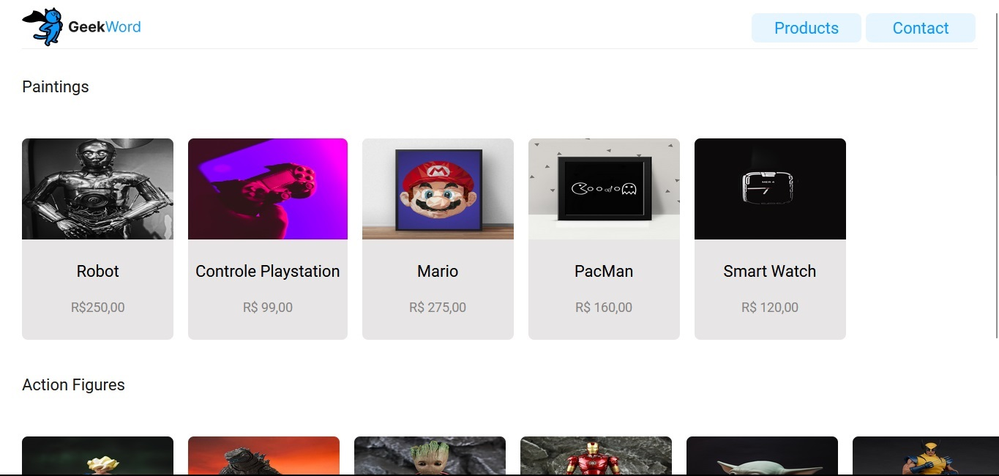

<h1 align="center"> GeekWord </h1>

Programa exclusivo, promovido pela Kenzie Academy para ensino de tecnologias WEB.  

  <a href="#-tecnologias">Tecnologias</a>&nbsp;&nbsp;&nbsp;|&nbsp;&nbsp;&nbsp;
  <a href="#-projeto">Projeto</a>&nbsp;&nbsp;&nbsp;|&nbsp;&nbsp;&nbsp;
  <a href="#memo-licença">Licença</a>

  

 

  

## 🚀 Tecnologias

Esse projeto foi desenvolvido com as seguintes tecnologias:

- HTML e CSS
- JavaScript
- Git e Github

## 💻 Projeto

O GeekWord é uma plataforma que atua como um catálogo virtual, apresentando de forma organizada e acessível uma ampla variedade de produtos em estoque, tornando a experiência de navegação e descoberta de itens geek mais intuitiva e prazerosa.

- [Acesse o projeto finalizado, online](https://kenzie-academy-brasil-developers.github.io/m1-catalogo-geek-template_Miguellljr/)

##  Licença

Esse projeto está sob a licença MIT.

---